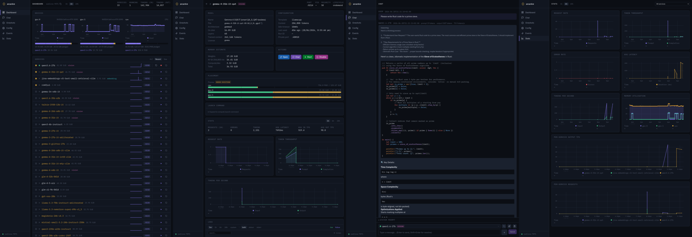

# ananke

[](docs/media/)

ananke is a GPU/CPU-aware model proxy daemon designed to manage multiple LLMs and other AI tools (like ComfyUI) efficiently. It provides an OpenAI-compatible API and a management CLI to orchestrate model loading, unloading, and resource allocation.

## Getting Started

### Prerequisites

ananke is currently Linux-only.

- **Rust toolchain** (stable) to build with `cargo`.
- **NVIDIA driver with NVML** (`libnvidia-ml.so`) on the host, for GPU detection and VRAM tracking. Without it the daemon falls back to CPU-only and any GPU-bound service fails placement.
- **`llama-server`** on `PATH`, if you plan to use the `llama-cpp` service template (the path the Quick Start below takes). Build or download it from [llama.cpp](https://github.com/ggml-org/llama.cpp). Point ananke at a non-`PATH` binary or wrap it in a container via [`daemon.llama_server`](docs/configuration.md#daemon-settings), the per-service `llama_server` field, or a full [`launcher` template](docs/configuration.md#custom-llama-server-binary-or-wrapper).

### Installation

The easiest way to get ananke is to download a prebuilt binary from the [GitHub releases](https://github.com/philpax/ananke/releases). Drop `ananke` and `anankectl` onto your `PATH` and you're ready to go.

### Building from source

If you'd rather build it yourself (requires `cargo` and `npm`):

```bash
git clone https://github.com/philpax/ananke.git
cd ananke
cargo build --release
```

The binaries are `ananke` and `anankectl`, found in `target/release`.

### Quick Start

Create a minimal config at `~/.config/ananke/config.toml`:

```toml
[[service]]
name = "my-model"
template = "llama-cpp"
port = 8200
model = "/path/to/model.gguf"
```

That's the whole config. Everything else has a sensible default: the OpenAI API listens on `127.0.0.1:7070`, the management API on `127.0.0.1:7071`, every visible NVIDIA GPU is probed, and the service is on-demand with a 10-minute idle timeout.

The [Configuration Guide](docs/configuration.md) has more details.

Start the daemon:

```bash
ananke
```

Then talk to it. The easiest way is the web dashboard, served at `http://localhost:7071` - open it in a browser, pick your model, and start chatting. The dashboard also shows live service status, logs, devices, and metrics.

If you prefer a CLI, `anankectl` is bundled:

```bash
anankectl chat my-model
```

Any OpenAI-compatible client also works - for example, with `curl`:

```bash
curl http://127.0.0.1:7070/v1/chat/completions \
  -H "Content-Type: application/json" \
  -d '{"model": "my-model", "messages": [{"role": "user", "content": "Hello!"}]}'
```

ananke loads the model on the first request, serves the response, then unloads it after 10 minutes of idle time to free VRAM.

## Configuration

ananke is configured via TOML, which will be located in this order:

1. `ANANKE_CONFIG` environment variable.
2. `--config` CLI argument.
3. `$XDG_CONFIG_HOME/ananke/config.toml`
4. `~/.config/ananke/config.toml`
5. `/etc/ananke/config.toml`

The full configuration guide - daemon settings, device and service configuration, placement, inheritance, and config hot-reload - lives in [docs/configuration.md](docs/configuration.md).

## Interacting with ananke

There are two ways to manage an running daemon, both of which are layers over the management API, documented in [docs/api.md](docs/api.md).

### Web Dashboard

A dashboard (pictured above) is served by the daemon at the management API's port (`http://<host>:7071`). It offers full access to ananke's state, with service monitoring, logs, metrics, and chat. This is the easiest way to see both what ananke is doing, and what it _has_ been doing.

### `anankectl`

`anankectl` lets you manage the daemon and talk to models with a CLI. It resolves its target endpoint from one of: `--endpoint`, the `ANANKE_ENDPOINT` env var, the `endpoint` key in `~/.config/anankectl/config.toml`, then the built-in default.

- **Status**: `status` for an at-a-glance view of the daemon, devices, and services.
- **Service management**: `services`, `show`, `start`, `stop`, `restart`, `enable`, `disable`, `retry`.
- **Monitoring**: `logs`, `devices`.
- **Daemon configuration**: `server-config`, `reload`.
- **Client configuration**: `config`
- **Chat**: `chat` for an interactive TUI session; `chat <model> <prompt>` streams a one-shot completion to stdout.
- **Oneshots**: `oneshot submit`, `oneshot list`, `oneshot kill`.

Each command has its own `--help` with full usage details.

## Configured vs temporary services

ananke distinguishes between services defined persistently in TOML and short-lived services spawned via the Oneshot API.

- **Configured services**: declared as `[[service]]` blocks in the config file; they survive daemon restarts and can be managed via `anankectl` and the management API. See [docs/configuration.md](docs/configuration.md).
- **Temporary services**: spawned on demand through the Oneshot API with an optional TTL; torn down automatically when their TTL expires or when explicitly killed. They are allocated from the same resource pool as configured services but do not persist across daemon restarts. See [docs/api.md](docs/api.md) for the Oneshot API.

## Comparing Alternatives

If you're looking for model management tools, you may also want to consider:

### llama-swap ([mostlygeek/llama-swap](https://github.com/mostlygeek/llama-swap))

A well-established Go proxy with 3.5k+ stars. It's excellent if you want to:

- Support diverse upstream servers beyond llama.cpp (vLLM, tabbyAPI, stable-diffusion.cpp).
- Use a built-in web UI for interacting with your models.
- Define concurrent model combinations with a solver-based DSL matrix.

llama-swap uses a matrix of valid model sets with a solver that picks the cheapest eviction when a new model is requested. It does not track VRAM - you must manually ensure models fit together on your GPU.

### Large Model Proxy ([perk11/large-model-proxy](https://github.com/perk11/large-model-proxy))

A smaller Go proxy with resource pool management. It's a good fit if you:

- Want resource-aware loading with manual VRAM/RAM declarations per service into shared pools.
- Need straightforward LRU-based eviction when the resource pool is exhausted.

Like llama-swap, it requires you to declare the VRAM each model will consume ahead of time.

### Goldseam ([avafloww/goldseam](https://github.com/avafloww/goldseam))

A Rust reverse proxy that keeps conversations warm across GPU swaps by moving KV/recurrent state instead of re-prefilling. It's interesting if you:

- Want warm KV-transfer swaps - snapshot a conversation's KV state, kill the process, and resume warm on next load.
- Prefer scheduling-as-code: placement decisions are a sandboxed TypeScript `decide()` function, hot-reloaded on save.
- Need demote-to-coexist: a live dual-GPU chat can be demoted onto a single card to make room for another model.

Goldseam is llama.cpp-only (requires a patched build) and uses a per-GPU VRAM budget with declared footprints rather than automatic estimation.

### How ananke Compares

| Feature             | ananke                       | llama-swap                       | Large Model Proxy                    | Goldseam                                    |
| ------------------- | ---------------------------- | -------------------------------- | ------------------------------------ | ------------------------------------------- |
| Language            | Rust                         | Go                               | Go                                   | Rust                                        |
| VRAM estimation     | **Automatic** (GGUF-aware)   | None (user-managed)              | Manual (declared per model in pools) | Manual (declared per model in catalog)      |
| Service templates   | `llama-cpp`, `command`       | Any upstream server              | Any command                          | llama.cpp only (patched build)              |
| Eviction strategy   | Priority-based               | Solver-based (cheapest eviction) | LRU                                  | Policy-driven (demote before evict)         |
| Model switch        | Cold (drain + restart)       | Cold (process swap + re-prefill) | Cold (process swap)                  | **Warm** (KV snapshot/restore)              |
| Scheduling          | TOML config (priority, idle) | YAML config (groups, TTL)        | Resource pools                       | TypeScript `decide()` policy (hot-reloaded) |
| Config hot-reload   | Yes, with preflight          | Yes                              | No                                   | Yes (policy file mtime-poll)                |
| CLI tool            | `anankectl` (comprehensive)  | Basic HTTP API                   | Basic HTTP API                       | Basic HTTP API                              |
| REST API            | Yes                          | Yes                              | Yes                                  | Yes (`/status` + routines)                  |
| Real-time events    | WebSocket                    | No                               | No                                   | No                                          |
| Web dashboard       | Yes                          | Yes                              | Yes                                  | No                                          |
| Service inheritance | `extends` with deep merge    | Macros                           | No                                   | No                                          |
| Oneshot API         | Yes                          | No                               | No                                   | No                                          |
| Model TTL           | Per model + oneshots         | Per model                        | Per model                            | No                                          |

**Choose ananke if:** You want automatic VRAM estimation (no manual declarations needed), a CLI/API for programmatic management, and a web dashboard for monitoring and chatting with models. ananke is designed for users who want to add models to their config and trust the daemon to figure out where they fit.

**Choose llama-swap if:** You need maximum flexibility with upstream servers, want a battle-tested solution with a large community, and prefer a solver-based matrix for defining which models can run concurrently.

**Choose Large Model Proxy if:** You want a lightweight proxy with resource pools, manual VRAM declarations, and don't need advanced features like service inheritance or real-time event streaming.

**Choose Goldseam if:** You switch models often enough that cold re-prefill hurts, you're on llama.cpp, and you want conversations to stay warm across GPU swaps - with placement decisions expressed as code.
